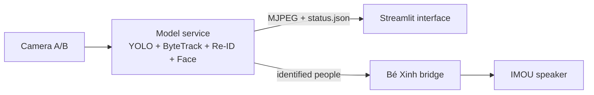

# Camera Tracking — Team Integration

Thư mục này hợp nhất ba phần theo kiến trúc **modular monorepo**, nhưng không
trộn code bằng cách ghi đè file cùng tên:

| Phần | Nguồn | Phiên bản đã lấy |
|---|---|---|
| Model + tracking | `AnhDuybugde/camera-ojt`, branch `main` | `df26cf3` |
| Giao diện | `hoangtran18012005-droid/ai-mind-attendance`, branch `main` | `843262a` |
| Audio “Bé Xinh” | working tree `camera-tracking`, branch `Ngoc` | snapshot 2026-09-21 |

Không sao chép `.env`, dữ liệu khuôn mặt, log hay model weights từ workspace
cũ. Source ban đầu ở `D:\camera-tracking` không bị sửa hoặc merge.

## Kiến trúc



```text
team-integration/
├── backend/                 camera-ojt/main + audio package
│   ├── src/camera_tracking/audio/
│   ├── src/camera_tracking/integration/
│   └── scripts/run_be_xinh_bridge.py
├── frontend/                AI Mind Streamlit interface
├── setup.ps1
├── run.ps1
├── stop.ps1
└── TEAM_WORKFLOW.md          ranh giới code của ba thành viên
```

### Tại sao ít conflict?

- `backend/` giữ nguyên model mới làm nguồn chuẩn; không thay `run_workstate.py`
  bằng bản cũ từ branch audio.
- `frontend/` chỉ đọc `/cam_a.mjpg`, `/cam_b.mjpg` và `/status.json`; nó không mở
  RTSP lần hai khi `TRACKING_BACKEND_URL` được cấu hình.
- Audio chạy qua adapter nhỏ. Model và audio chỉ thống nhất một contract JSON,
  nên mỗi thành viên có thể phát triển module của mình độc lập.

## Cài đặt trên Windows

Yêu cầu: Python 3.10–3.12 (khuyến nghị 3.12), Node không bắt buộc cho giao diện
Streamlit, `ffmpeg` trong `PATH`, và camera/driver GPU theo README trong `backend/`.
Script tự chọn một bản Python tương thích và tự bật CUDA khi phát hiện NVIDIA GPU.

```powershell
cd D:\team-integration
.\setup.ps1
```

Có thể chọn rõ Python hoặc buộc dùng CPU khi cần:

```powershell
.\setup.ps1 -PythonVersion 3.12
.\setup.ps1 -CpuOnly
```

Sau đó sửa `backend/.env`:

- `IMOU_IP`, `IMOU_USER`, `IMOU_PASSWORD` cho camera.
- `IMOU_DEVICE_ID`, `IMOU_CAMERA_PASSWORD` nếu module model cần P2P.
- `IMOU_TALK_HELPER` trỏ đến `frigate_imou_talk_exec.py` của Bé Xinh.
- Supabase/Gemini chỉ điền khi thực sự sử dụng.

Tạo cache audio trước khi chạy production:

```powershell
cd backend
.\.venv\Scripts\python.exe scripts\prewarm_hamy.py
cd ..
```

## Chạy và dừng

```powershell
.\run.ps1
# UI: http://127.0.0.1:8501
# Model status: http://127.0.0.1:8765/status.json

.\stop.ps1
```

Launcher tắt greeting “Hà Linh”/legacy của model để tránh hai giọng nói đồng
thời; “Bé Xinh” là audio output duy nhất. Log nằm trong `logs/`.

## Kiểm thử

```powershell
cd backend
.\.venv\Scripts\python.exe -m pytest -q tests\test_be_xinh_bridge.py `
  tests\test_hamy_companion.py tests\test_hamy_interaction.py

cd ..\frontend
.\.venv\Scripts\python.exe -m compileall -q .
```

## Phạm vi adapter hiện tại

Bridge xử lý người đã được model xác nhận, heartbeat hiện diện, arrival/return
và reminder theo chính sách của `HamyCompanion`. Module gesture của Bé Xinh vẫn
được bảo toàn trong source, nhưng chưa lấy frame/bounding-box qua status API;
do đó gesture riêng của audio chưa được bật trong sidecar. Nếu cần gesture
5-ngón của Bé Xinh, nên mở rộng contract API thay vì chép đè vòng lặp model.

Trang **Live Attendance** đã dùng chung camera/model backend. Các trang báo cáo
còn lại của UI vẫn đọc SQLite riêng của repository giao diện, trong khi backend
dùng queue/Supabase của `camera-ojt`; bản tích hợp không âm thầm đồng bộ hai kho
dữ liệu vì cần nhóm thống nhất nguồn dữ liệu chuẩn trước.
