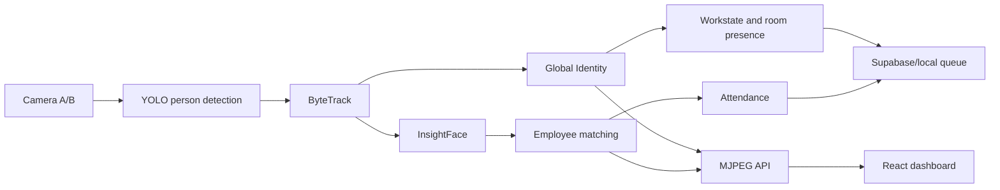

# Camera OJT

Hệ thống điểm danh và theo dõi trạng thái nhân viên bằng hai camera:

- YOLO phát hiện người (person detection).
- ByteTrack và Global Identity theo dõi người trong và giữa hai camera.
- InsightFace `buffalo_s` đăng ký và nhận diện khuôn mặt trên Channel A/B.
- React + Vite cung cấp màn hình check-in, camera trực tiếp và trang quản trị.
- Supabase lưu nhân viên, điểm danh và trạng thái phòng (tùy chọn).

## 1. Yêu cầu máy

- Windows 10/11 và PowerShell.
- Git.
- Python 3.10 trở lên. Dự án hiện đã kiểm thử với Python 3.12.
- Node.js 20 trở lên và npm.
- Camera RTSP hoặc webcam/video để thử nghiệm.
- NVIDIA GPU được khuyến nghị. Hệ thống vẫn chạy CPU nhưng chậm hơn.

## 2. Clone branch Ngoc

```powershell
git clone -b Ngoc https://github.com/AnhDuybugde/camera-ojt.git
cd camera-ojt
```

Nếu repository đã có sẵn trên máy:

```powershell
git fetch origin
git switch Ngoc
git pull --ff-only origin Ngoc
```

## 3. Cài backend Python

Tạo virtual environment riêng cho dự án:

```powershell
py -3.12 -m venv yolovenv
.\yolovenv\Scripts\Activate.ps1
python -m pip install --upgrade pip setuptools wheel
python -m pip install -e ".[face,store,dev]"
```

Nếu PowerShell chặn script kích hoạt, chạy một lần trong terminal hiện tại:

```powershell
Set-ExecutionPolicy -Scope Process -ExecutionPolicy Bypass
.\yolovenv\Scripts\Activate.ps1
```

`reid` là dependency bắt buộc cho production. Pipeline sẽ dừng rõ ràng nếu
OSNet không tải được; không tự hạ xuống histogram vì có thể nối nhầm người:

```powershell
python -m pip install -e ".[reid]"
```

Để dùng CUDA, cài bản PyTorch tương thích với GPU/driver trước khi chạy. Kiểm tra:

```powershell
python -c "import torch; print('CUDA:', torch.cuda.is_available())"
```

## 4. Cấu hình camera và Supabase

Tạo `.env` từ file mẫu:

```powershell
Copy-Item .env.example .env
```

Mở `.env` và thay bằng thông tin thật:

```dotenv
IMOU_IP=192.168.1.100
IMOU_USER=admin
IMOU_PASSWORD=your_camera_password

SUPABASE_URL=https://your-project.supabase.co
SUPABASE_SERVICE_KEY=your_service_role_key
SUPABASE_ANON_KEY=your_anon_key
```

Camera A và B mặc định dùng channel `1` và `2` trên cùng thiết bị IMOU. Có thể
ghi đè nguồn khi chạy bằng `--source-a` và `--source-b`.

Supabase là tùy chọn. Nếu sử dụng:

1. Chạy [supabase/schema.sql](supabase/schema.sql) trong Supabase SQL Editor.
2. Tạo hai Storage bucket `face-crops` và `enrolled-faces`.
3. Tạo tài khoản quản trị và thêm role:

```sql
insert into public.roles (user_id, role)
values ('<uuid-admin>', 'admin');
```

Không đưa `SUPABASE_SERVICE_KEY` vào frontend. Key này chỉ được lưu trong `.env`
ở máy chạy pipeline.

## 5. Cài frontend

```powershell
Copy-Item dashboard\.env.example dashboard\.env
Set-Location dashboard
npm install
Set-Location ..
```

Các biến frontend chính trong `dashboard/.env`:

```dotenv
VITE_STREAM_URL=http://localhost:8765
VITE_KIOSK_CHANNEL=A
VITE_CONTROL_URL=http://localhost:8766
VITE_SUPABASE_URL=https://your-project.supabase.co
VITE_SUPABASE_ANON_KEY=your_anon_key
```

Có thể bỏ trống cấu hình Supabase khi chỉ thử camera và đăng ký nhân viên cục bộ.

## 6. Chạy hệ thống (2 lệnh)

Lệnh 1 — backend + supervisor (tự bật sẵn API `:8766` cho dashboard):

```powershell
.\yolovenv\Scripts\Activate.ps1
python scripts\run_workstate.py --greet
```

Lệnh 2 — dashboard:

```powershell
Set-Location dashboard
npm run dev
```

Muốn tắt supervisor nhúng: thêm `--no-supervisor` (dashboard mất nút
Start/Stop) hoặc đổi cổng `--supervisor-port 8770`.

Truy cập địa chỉ Vite in trên terminal, thông thường là:

```text
http://localhost:5173
```

Backend camera và API chạy mặc định tại:

```text
http://localhost:8765
```

Lần chạy đầu, Ultralytics và InsightFace có thể tải model `yolo26s.pt` và
`buffalo_s`. Cần giữ kết nối mạng cho đến khi tải xong.

## 7. Đăng ký nhân viên

1. Mở dashboard và vào `Đăng ký nhân viên`.
2. Nhập mã nhân viên duy nhất và họ tên.
3. Chụp/tải ảnh chỉ có một khuôn mặt, rõ, đủ sáng và nhìn gần chính diện.
4. Xác nhận đồng ý xử lý dữ liệu khuôn mặt rồi nhấn đăng ký.
5. Đứng trước Channel A khoảng 1-2 giây để kiểm tra nhận diện/check-in.

Thông tin đăng ký cục bộ nằm trong `data/images/registry.json`; ảnh nằm trong
`data/images/`. Cả hai đều bị `.gitignore` loại khỏi Git vì là dữ liệu cá nhân.
Khi chuyển sang máy khác, phải đăng ký lại hoặc chuyển dữ liệu qua kênh bảo mật
có sự đồng ý của nhân viên.

Không đăng ký cùng một khuôn mặt dưới nhiều mã nhân viên. Việc này làm danh tính
không xác định khi hai embedding gần như giống nhau.

## 8. Chạy từ máy khác trong mạng LAN

Trên máy gắn camera:

```powershell
python scripts\run_workstate.py --stream-host 0.0.0.0
```

Trên máy chạy dashboard, sửa:

```dotenv
VITE_STREAM_URL=http://<IP_MAY_CAMERA>:8765
```

Khởi động lại `npm run dev` sau khi thay biến môi trường. Cho phép cổng `8765`
qua Windows Firewall nếu máy khác không truy cập được.

## 9. Lệnh hữu ích

```powershell
# Chạy tracking nhưng tắt nhận diện khuôn mặt
python scripts\run_workstate.py --no-face --display

# Dùng webcam 0 và 1 thay cho RTSP
python scripts\run_workstate.py --source-a 0 --source-b 1 --display

# Giảm tải GPU/CPU
python scripts\run_workstate.py --imgsz 640

# Benchmark model, không mở RTSP
python scripts\benchmark_inference.py --device cuda --frames 30

# Chạy kiểm thử backend
python -m pytest -q

# Kiểm tra frontend production build
Set-Location dashboard
npm run build
```

## 10. Xử lý lỗi thường gặp

### Không mở được camera A/B

- Kiểm tra `IMOU_IP`, user/password và channel trong `.env`.
- Xác nhận máy và camera cùng mạng, RTSP đã được bật.
- Thử truyền URL/video/webcam bằng `--source-a` và `--source-b`.
- Không đặt chuỗi chữ `RTSP stream` vào `.env`; đây chỉ là nhãn log đã ẩn mật khẩu.

### Đăng ký xong vẫn hiện Unknown

- Kiểm tra log có dòng `Face gallery: N nguoi`, với `N > 0`.
- Đảm bảo không chạy `--no-face`.
- Đứng đủ gần, nhìn gần chính diện và tránh ngược sáng.
- Channel A và B đều hỗ trợ face matching; Channel A là kênh kiosk mặc định.
- Không dùng cùng một ảnh/khuôn mặt cho hai mã nhân viên.

### Dashboard không có hình

- Mở `http://localhost:8765/status.json` để kiểm tra backend.
- Kiểm tra `VITE_STREAM_URL` và khởi động lại Vite sau khi sửa.
- Nếu cổng đang bận, dừng tiến trình cũ hoặc chọn `--stream-port` khác.

## Kiến trúc rút gọn



Entry point production chính là `scripts/run_workstate.py`.
`scripts/run_pipeline.py` chỉ là demo analytics một camera dùng cho smoke test.

Contract Global ID, face consensus và replay benchmark được mô tả tại
[docs/IDENTITY_ARCHITECTURE.md](docs/IDENTITY_ARCHITECTURE.md).

## Bảo mật dữ liệu

- Không commit `.env`, service key, mật khẩu RTSP hoặc ảnh khuôn mặt.
- Chỉ thu thập ảnh khi nhân viên đã đồng ý.
- Giới hạn quyền truy cập Supabase và định kỳ xóa ảnh không còn cần thiết.
- Global ID chỉ là ID theo dõi tạm thời; `employee_id` sau face matching mới là
  danh tính nhân viên dùng cho chấm công.
