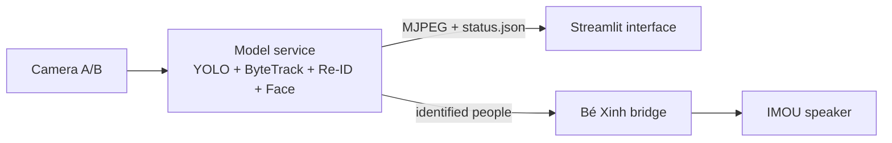

# Camera Tracking — Team Integration

Thư mục này hợp nhất ba phần theo kiến trúc **modular monorepo**, nhưng không
trộn code bằng cách ghi đè file cùng tên:

| Phần | Nguồn | Phiên bản đã lấy |
|---|---|---|
| Model + tracking | `AnhDuybugde/camera-ojt`, branch `main` | `df26cf3` |
| Giao diện | `hoangtran18012005-droid/ai-mind-attendance`, branch `main` | `843262a` |
| Audio “Bé Xinh” | working tree `camera-tracking`, branch `Ngoc` | snapshot 2026-09-21 |

Không sao chép `.env`, dữ liệu khuôn mặt, log hay model weights từ workspace
cũ. Source ban đầu ở `D:\camera-tracking` không bị sửa hoặc merge.

## Kiến trúc



```text
team-integration/
├── backend/                 camera-ojt/main + audio package
│   ├── src/camera_tracking/audio/
│   ├── src/camera_tracking/integration/
│   └── scripts/run_be_xinh_bridge.py
├── frontend/                AI Mind Streamlit interface
├── setup.ps1
├── run.ps1
├── stop.ps1
└── TEAM_WORKFLOW.md          ranh giới code của ba thành viên
```

### Tại sao ít conflict?

- `backend/` giữ nguyên model mới làm nguồn chuẩn; không thay `run_workstate.py`
  bằng bản cũ từ branch audio.
- `frontend/` chỉ đọc `/cam_a.mjpg`, `/cam_b.mjpg` và `/status.json`; nó không mở
  RTSP lần hai khi `TRACKING_BACKEND_URL` được cấu hình.
- Audio chạy qua adapter nhỏ. Model và audio chỉ thống nhất một contract JSON,
  nên mỗi thành viên có thể phát triển module của mình độc lập.

## Cài đặt trên Windows

Yêu cầu: Python 3.10–3.12 (khuyến nghị 3.12), Node không bắt buộc cho giao diện
Streamlit, `ffmpeg` trong `PATH`, và camera/driver GPU theo README trong `backend/`.
Script tự chọn một bản Python tương thích và tự bật CUDA khi phát hiện NVIDIA GPU.

```powershell
cd D:\team-integration
.\setup.ps1
```

Có thể chọn rõ Python hoặc buộc dùng CPU khi cần:

```powershell
.\setup.ps1 -PythonVersion 3.12
.\setup.ps1 -CpuOnly
```

Sau đó sửa `backend/.env`:

- `IMOU_IP`, `IMOU_USER`, `IMOU_PASSWORD` cho camera.
- `IMOU_DEVICE_ID`, `IMOU_CAMERA_PASSWORD` nếu module model cần P2P.
- `IMOU_TALK_HELPER` trỏ đến `frigate_imou_talk_exec.py` của Bé Xinh.
- Supabase/Gemini chỉ điền khi thực sự sử dụng.

Tạo cache audio trước khi chạy production:

```powershell
cd backend
.\.venv\Scripts\python.exe scripts\prewarm_hamy.py
cd ..
```

## Chạy và dừng

```powershell
.\run.ps1
# UI: http://127.0.0.1:8501
# Model status: http://127.0.0.1:8765/status.json

.\stop.ps1
```

Launcher tắt greeting legacy của model để tránh hai giọng nói đồng thời;
“Bé Xinh” là audio output duy nhất. Log nằm trong `logs/`.

Kiểm tra dịch vụ mà không đọc dữ liệu nhân viên:

```powershell
Invoke-RestMethod http://127.0.0.1:8765/healthz
Invoke-RestMethod http://127.0.0.1:8765/readyz
```

`readyz` chỉ trả HTTP 200 khi trạng thái model và ít nhất một frame camera còn
mới. Khi chuẩn bị triển khai thật, làm theo [PRODUCTION_DEPLOYMENT.md](PRODUCTION_DEPLOYMENT.md)
và [SECURITY.md](SECURITY.md); chỉ phát hành nếu preflight strict trả mã `0`.

## Kiểm thử

```powershell
cd backend
.\.venv\Scripts\python.exe -m pytest -q tests\test_be_xinh_bridge.py `
  tests\test_hamy_companion.py tests\test_hamy_interaction.py

cd ..\frontend
.\.venv\Scripts\python.exe -m compileall -q .
```

## Phạm vi adapter hiện tại

Bridge xử lý người đã được model xác nhận, heartbeat hiện diện, arrival/return,
gesture 5-ngón, approach/stand-up và reminder theo chính sách của
`HamyCompanion`. Model tái sử dụng frame + bounding box hiện có để phát các
`gesture_events`, `motion_events` và `stationary_for_s` qua status API; Bé Xinh
không mở camera hoặc chạy YOLO lần hai. Lời chào, nhắc nước/nghỉ và lời rủ
high-five được luân phiên nhưng luôn có cooldown chống spam.

### Voice thân thiện và vùng chào gần

- Giơ bàn tay mở được xác nhận qua 2 mẫu liên tiếp; bridge poll mỗi `0.12s` và
  lời chào tay có ưu tiên cao nhất trong hàng đợi.
- Khi đã nhận diện được người, mọi biến thể chào tay/chào gần đều chứa tên và
  được luân phiên để tránh lặp nguyên văn.
- Chào tự động chỉ xảy ra khi `near_camera=true`; giơ tay vẫn được phản hồi dù
  đang ở xa. Ngưỡng mặc định là khoảng `0.50m`, nhả trạng thái ở `0.70m` để
  tránh bật/tắt liên tục tại biên.
- Camera RGB không phải cảm biến độ sâu. `estimated_distance_m` là ước lượng
  từ chiều cao bbox và cần hiệu chuẩn một lần: đứng đúng `1m`, mở `status.json`,
  đọc `person_height_ratio` rồi điền giá trị đó vào
  `HAMY_DISTANCE_REFERENCE_HEIGHT_RATIO` trong
  `backend/.env`. Các biến liên quan có sẵn trong `.env.example`.

Sau khi đổi lời thoại hoặc thêm nhân viên, chạy lại cache khi camera đã dừng:

```powershell
cd D:\team-integration\backend
.\.venv\Scripts\python.exe scripts\prewarm_hamy.py
# Chỉ tạo các câu cần phản hồi ngay (chào gần + vẫy tay):
.\.venv\Scripts\python.exe scripts\prewarm_hamy.py --critical-only
```

Trang **Live Attendance** đã dùng chung camera/model backend. Các trang báo cáo
còn lại của UI vẫn đọc SQLite riêng của repository giao diện, trong khi backend
dùng queue/Supabase của `camera-ojt`; bản tích hợp không âm thầm đồng bộ hai kho
dữ liệu vì cần nhóm thống nhất nguồn dữ liệu chuẩn trước.

### Audio Zone Event Engine

Bridge hỗ trợ contract `audio_events` cho `DOOR_ENTER`, `DOOR_EXIT`,
`BE_XINH_NEAR`, `WATER`, `RESTROOM` và `WAVE`, đồng thời nhận generic
`ZONE_DWELL`. Khi backend có trường `audio_events` (kể cả danh sách rỗng), Zone
Mode tắt chào theo kiểu chỉ thấy mặt; sự kiện WC không bao giờ đọc tên. Event ID
dedupe, cooldown theo người/sự kiện, global gap, priority và queue expiry ngăn
phát lặp hoặc phát câu đã cũ. Contract chi tiết nằm tại
`backend/docs/AUDIO_EVENT_CONTRACT.md`.

```powershell
cd backend
.\.venv\Scripts\python.exe scripts\test_be_xinh_events.py --dry-run --event wave --name Ngọc
.\.venv\Scripts\python.exe scripts\test_be_xinh_events.py --dry-run --generic-zone restroom --name Ngọc
```

### Trò chuyện bằng giọng nói với Bé Xinh

Luồng chạy hoàn toàn bằng giọng nói:

`Mic camera → STT tiếng Việt → Gemini 3.5 Flash → ZeroTTS Hà My → loa camera`

Thêm khóa vào `backend/.env` trên máy cá nhân, không commit khóa lên Git:

```env
GEMINI_API_KEY=your_real_key_here
GEMINI_MODEL=gemini-3.5-flash
```

Bật hoặc kiểm tra riêng voice chat mà không khởi động lại camera:

```powershell
.\chat.ps1 start
.\chat.ps1 status
# Gọi: "Bé Xinh ơi"
.\chat.ps1 stop
```

Lần chạy đầu sẽ tạo năm câu filler bằng giọng Hà My. Những lần sau dùng lại
cache. `run.ps1` tự bật voice chat khi `GEMINI_API_KEY` đã được cấu hình.
