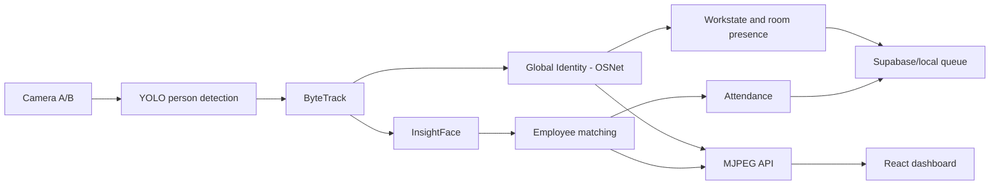

# Camera OJT

Điểm danh và theo dõi trạng thái nhân viên bằng camera:

- **Nhìn**: YOLO phát hiện người → ByteTrack → Global Identity (OSNet ReID) giữ ID xuyên camera; InsightFace `buffalo_s` nhận diện khuôn mặt để điểm danh; MediaPipe phát hiện vẫy/giơ tay để chào.
- **Nghe–nói**: trợ lý voice “Hà Linh” (mic RTSP + loa camera P2P, STT faster-whisper, hiểu lệnh bằng Gemini, nói bằng ZeroTTS).
- **Hiện**: React + Vite (live MJPEG, check-in kiosk, quản trị) + Supabase (tùy chọn, offline vẫn chạy nhờ hàng đợi local).

## 1. Yêu cầu

- Git, Python 3.10+ (đã kiểm thử 3.10–3.12), Node.js 20+ và npm.
- `ffmpeg` trong PATH (mic RTSP, TTS, loa).
- Camera RTSP (Imou) hoặc webcam/video để thử. NVIDIA GPU khuyến nghị (chạy CPU vẫn được nhưng chậm).
- Linux và Windows đều chạy được. Lệnh dưới đây là Linux/macOS; trên Windows PowerShell thay `cp` bằng `Copy-Item`, `source .venv/bin/activate` bằng `.venv\Scripts\Activate.ps1`.

## 2. Lấy code

```bash
git clone https://github.com/AnhDuybugde/camera-ojt.git
cd camera-ojt
```

Máy đã có repo thì cập nhật nhánh `main`:

```bash
git fetch origin
git switch main
git pull --ff-only origin main
```

## 3. Cài backend Python

```bash
python3 -m venv .venv
source .venv/bin/activate
python -m pip install --upgrade pip setuptools wheel
python -m pip install -e ".[face,store,reid,voice,dev]"
# hoặc: pip install -r requirements.txt  (tương đương dòng trên)
```

`reid` (OSNet) là bắt buộc ở production — pipeline dừng rõ ràng nếu không tải được, không tự hạ cấp. Muốn dùng CUDA thì cài PyTorch đúng driver **trước**:

```bash
pip install torch torchvision torchaudio --index-url https://download.pytorch.org/whl/cu124
python -c "import torch; print('CUDA:', torch.cuda.is_available())"
```

Lần chạy đầu cần mạng để tải `yolo26s.pt` (Ultralytics) và `buffalo_s` (InsightFace). File `.engine` (TensorRT) và `.pt` **không commit** — máy mới tự tải lại.

## 4. Cấu hình `.env`

```bash
cp .env.example .env
```

Mở `.env` và điền giá trị thật (xem chú thích trong file mẫu):

| Biến | Dùng cho | Bắt buộc khi nào |
|---|---|---|
| `IMOU_IP`, `IMOU_USER`, `IMOU_PASSWORD` | RTSP hình + mic camera | Chạy bản camera |
| `IMOU_DEVICE_ID`, `IMOU_CAMERA_PASSWORD` | Loa camera qua P2P VisualTalk | Chào/nói ra loa (`--greet`, `--halinh`) |
| `GEMINI_API_KEY` (`GEMINI_MODEL` tùy chọn) | Trợ lý Hà Linh | Chạy `--halinh` (mặc định bật) |
| `SUPABASE_URL`, `SUPABASE_SERVICE_KEY`, `SUPABASE_ANON_KEY` | Lưu điểm danh online | Khi muốn đồng bộ cloud |

Kênh loa (`voice.p2p_channel`, `voice.p2p_channel_b`) nằm trong `config/default.yaml`, không cần `.env`. Supabase là tùy chọn: nếu dùng thì chạy `supabase/schema.sql` trong SQL Editor, tạo 2 bucket `face-crops`, `enrolled-faces`, rồi bật `store.supabase_enabled: true` trong config. Không bao giờ đưa `SUPABASE_SERVICE_KEY` vào frontend.

## 5. Cài frontend

```bash
cp dashboard/.env.example dashboard/.env
cd dashboard && npm install && cd ..
```

Biến chính trong `dashboard/.env` (mặc định đã đúng khi chạy local):

```dotenv
VITE_STREAM_URL=http://localhost:8765
VITE_KIOSK_CHANNEL=A
VITE_CONTROL_URL=http://localhost:8766
```

## 6. Tạo file chào (WAV)

File WAV trong `output/` **không commit** — máy mới tự tạo lại:

```bash
source .venv/bin/activate
python scripts/build_greeting_wavs.py --voice maichi
```

Chạy lại mỗi khi thêm/sửa nhân viên hoặc đổi câu chào.

## 7. Chạy

**Bản camera** (2 cam Imou + voice Hà Linh, triển khai thật) — terminal 1:

```bash
source .venv/bin/activate
python scripts/run_workstate.py --greet
```

**Bản local** (webcam + mic/loa laptop, dev không cần camera):

```bash
python scripts/run_workstate_local.py --display
```

**Dashboard** — terminal 2:

```bash
cd dashboard && npm run dev   # thường là http://localhost:5173
```

Cổng mặc định: camera/MJPEG `:8765`, điều khiển pipeline `:8766`. Backend `run_workstate*.py` mặc định tự bật voice Hà Linh ở subprocess riêng (crash tự restart 3 lần); tắt bằng `--no-halinh`. Muốn tắt supervisor nhúng thì thêm `--no-supervisor`.

## 8. Đăng ký nhân viên

1. Mở dashboard → `Đăng ký nhân viên`.
2. Nhập mã nhân viên duy nhất + họ tên.
3. Chụp/tải ảnh **một khuôn mặt**, rõ, đủ sáng, gần chính diện.
4. Đồng ý xử lý dữ liệu khuôn mặt → đăng ký.
5. Đứng trước Channel A 1–2 giây để kiểm tra nhận diện/check-in.

Gallery nằm ở `data/images/` + `data/images/registry.json` — là dữ liệu cá nhân, **bị `.gitignore`**, máy mới phải đăng ký lại (hoặc chuyển qua kênh bảo mật có sự đồng ý). Không đăng ký cùng một khuôn mặt cho nhiều mã.

## 9. Chạy từ máy khác trong LAN

Máy gắn camera:

```powershell
$env:CAMERA_ALLOW_REMOTE_STREAM = "1"
python scripts/run_workstate.py --stream-host 0.0.0.0
```

Chỉ bật chế độ này trong mạng nội bộ đã được bảo vệ. Với môi trường production,
hãy giữ dịch vụ ở `127.0.0.1` và truy cập qua reverse proxy/VPN có xác thực.

Máy chạy dashboard sửa `dashboard/.env`:

```dotenv
VITE_STREAM_URL=http://<IP_MAY_CAMERA>:8765
```

Khởi động lại `npm run dev`; mở firewall cổng `8765` nếu cần.

## 10. Lệnh hữu ích

```bash
# Tracking nhưng tắt nhận diện mặt
python scripts/run_workstate.py --no-face --display
# Tắt voice Hà Linh (chỉ tracking + chào tay)
python scripts/run_workstate.py --no-halinh
# Webcam thay RTSP
python scripts/run_workstate.py --source-a 0 --source-b 1 --display
# Nhẹ GPU/CPU hơn
python scripts/run_workstate.py --imgsz 640
# Voice rời (debug, không cần pipeline)
python scripts/halinh_assistant.py              # bản camera
python scripts/halinh_assistant_local.py        # bản laptop
# Test loa P2P trực tiếp
python scripts/test_imou_p2p_voice.py --greeting unknown
# Benchmark model, không mở RTSP
python scripts/benchmark_inference.py --device cuda --frames 30
# Kiểm thử backend
python -m pytest -q
# Build frontend production
cd dashboard && npm run build
```

## 11. Xử lý lỗi thường gặp

**Không mở được camera A/B** — kiểm tra `IMOU_IP`/user/password trong `.env`, máy và camera cùng mạng, RTSP đã bật; thử `--source-a/--source-b` với video/webcam.

**Đăng ký xong vẫn Unknown** — log phải có `Face gallery: N nguoi` với `N > 0`; không chạy `--no-face`; đứng gần, nhìn chính diện, tránh ngược sáng; không dùng một mặt cho hai mã.

**Dashboard không có hình** — mở `http://localhost:8765/status.json`; kiểm tra `VITE_STREAM_URL` rồi khởi động lại Vite; cổng bận thì đổi `--stream-port`.

**Hà Linh không trả lời** — thiếu `GEMINI_API_KEY` trong `.env`; kiểm tra mic RTSP (`IMOU_*`) và loa P2P (`IMOU_DEVICE_ID` + `IMOU_CAMERA_PASSWORD`); hết quota Gemini thì loa báo và tự thử lại sau 60s.

## Kiến trúc rút gọn



Entry point production là `scripts/run_workstate.py` (camera) và `scripts/run_workstate_local.py` (laptop). `scripts/run_pipeline.py` chỉ là demo một camera. Contract Global ID, face consensus và replay benchmark ở `docs/IDENTITY_ARCHITECTURE.md`; tổng quan voice + chống spam ở `docs/OVERVIEW.md`; tune ngưỡng ở `docs/TUNE_GUIDE.md`; loa P2P ở `docs/P2P_TALK.md`.

## Bảo mật dữ liệu

- Không commit `.env`, service key, mật khẩu RTSP, ảnh khuôn mặt, WAV chào tên riêng, file `.engine`/`.pt`.
- Chỉ thu thập ảnh khi nhân viên đã đồng ý; giới hạn quyền Supabase; xóa ảnh không cần thiết định kỳ.
- Global ID chỉ là ID theo dõi tạm thời; `employee_id` sau face matching mới là danh tính chấm công.
